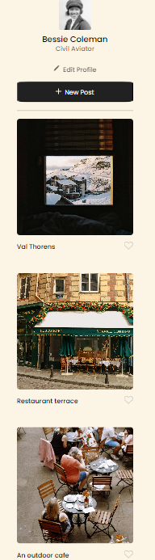
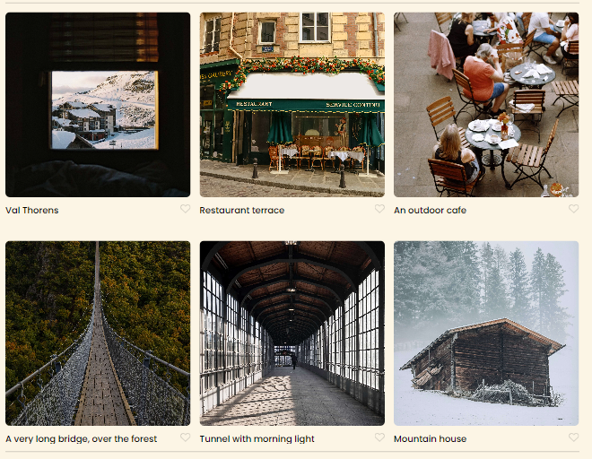

# Spots

An image sharing site

## Description

The name of this project is se_project_spots. To describe this as I understand it from the lessons its a image sharing app where users can post and like other users images. I used VS code to write and style the code and Figma. The profect file on Figma was the source and I suppose brief as well for the project.
I used my newly learned skill display grid and grid template columns to style the cards as well as the media query for mobile screens. I am still very new and very unsure of my coding skills and I am sure I made errors. My footer and mobile screen seem sloppy to me but I did my best.
I included 2 pictures showing my first time using grid in action as well as the how the mobile layout turned out

## Tech Stack

HTML
CSS
Responsive Design

## Figma

[Link to the project on Figma](https://www.figma.com/file/BBNm2bC3lj8QQMHlnqRsga/Sprint-3-Project-%E2%80%94-Spots?type=design&node-id=2%3A60&mode=design&t=afgNFybdorZO6cQo-1)

## Image mobile display and Grid

## Video

My video for project 3 {https://drive.google.com/file/d/1q9W4hf2_bpNa_3UES2A8iTj5EIKiM-gU/view?usp=sharing}

## Deployment

- Deployment Link: https://3clipser.github.io/se_project_spots/
